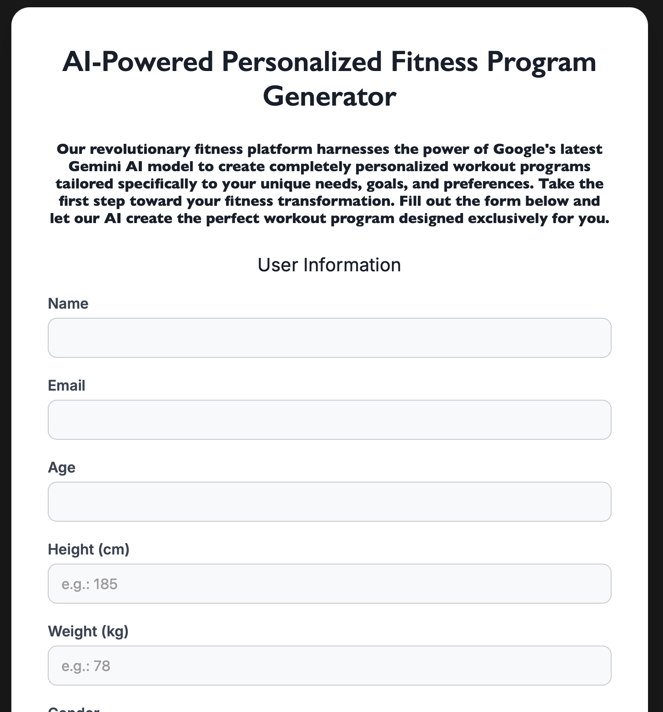

# AI-Powered Personal Training Program

An intelligent fitness application that generates personalized workout plans using AI, powered by Google's Gemini model and automated through n8n workflows.

## 🎯 Overview

This application collects user fitness data through a web form and automatically generates customized training programs tailored to individual goals, experience levels, and preferences. The entire process is automated using n8n workflows and delivers professionally formatted training plans directly to users' email.

**Live Demo:** [https://ai-training-plan.onrender.com/index.html](https://ai-training-plan.onrender.com/index.html)

## ✨ Features

- **Personalized Training Plans**: AI-generated workouts based on user-specific data
- **Comprehensive User Profiling**: Collects name, age, height, weight, gender, activity level, goals, training experience, frequency, duration, injuries, and fitness preferences
- **Human-in-the-Loop Verification**: Optional manual review and approval process before sending programs
- **Automated Email Delivery**: Professionally formatted training programs sent directly to users
- **Iterative Optimization**: Built-in loop mechanism for continuous program refinement
- **Vector Database Integration**: Stores and retrieves relevant training exercises using Qdrant

## 💪 Training Form 



The user-friendly web form collects comprehensive fitness data to ensure the AI can generate the most relevant and effective training program. The form is designed to be intuitive and quick to complete, typically taking just 2-3 minutes.

### Collected Data:

**Personal Information**: 
- Name, age, height, weight, gender
- Used to calculate appropriate intensity levels and caloric recommendations

**Fitness Profile**: 
- Current activity level (sedentary to very active)
- Primary training goal (weight loss, muscle gain, endurance, etc.)
- Training experience level (beginner, intermediate, advanced)

**Training Preferences**: 
- Desired training frequency per week
- Available session duration
- Access to equipment (bodyweight, dumbbells, full gym, etc.)
- Preferred training style

**Health Considerations**: 
- Current fitness level assessment
- Any injuries or physical limitations
- Special requirements or medical considerations

## 🏗️ Architecture

The workflow consists of three main components working seamlessly together:


### 1. AI Agent Workflow (Initial Generation)

This is where the magic begins. The AI Agent receives your form data and creates your personalized program:

- **Webhook Trigger**: Receives training form data in real-time when submitted
- **Data Processing**: Validates and structures user information for AI processing
- **AI Generation**: Google Gemini Chat Model analyzes your profile and generates a comprehensive training program
- **Exercise Database**: Integrates with Qdrant Vector Store to retrieve the most relevant exercises based on your goals and equipment
- **Program Formatting**: Generates a professionally formatted HTML email template with detailed exercise instructions, sets, reps, and progression guidelines

### 2. Human-in-the-Loop Verification (Quality Control)

An optional but valuable step that ensures program quality:

- **Manual Review**: Certified trainers can review AI-generated programs
- **Quality Assurance**: Verify that exercises are appropriate for the user's level and goals
- **Modifications**: Trainers can make adjustments if needed
- **Approval Process**: Gmail notification sent to designated reviewer
- **Conditional Flow**: Program only proceeds to optimization after approval

### 3. Program Optimization Loop (Refinement)

The final polish that makes your program truly exceptional:

- **Iterative Enhancement**: Program goes through up to 3 refinement cycles
- **AI Optimization**: Google Gemini analyzes and improves program structure, exercise selection, and progression
- **Balance Check**: Ensures proper muscle group distribution and recovery time
- **Progressive Overload**: Verifies that the program includes appropriate progression mechanisms
- **Final Approval**: Last quality check before delivery
- **Email Delivery**: Sends the completed, optimized program to your inbox

## 📧 Your Personalized Training Program


### What You'll Receive:

Once the workflow is complete, you'll receive a professionally formatted email containing:

**Program Overview**:
- Your personalized training goals
- Weekly schedule breakdown
- Equipment requirements
- Estimated duration and intensity

**Detailed Workout Plans**:
- Day-by-day exercise routines
- Exercise descriptions with proper form cues
- Sets, reps, and rest periods
- Progression guidelines for each week

**Exercise Instructions**:
- Step-by-step execution guides
- Common mistakes to avoid
- Modification options for different fitness levels
- Video links or visual references (when available)

## 🛠️ Technology Stack

- **Frontend**: HTML, CSS, JavaScript
- **Automation**: n8n workflow automation
- **AI Model**: Google Gemini Chat Model
- **Vector Database**: Qdrant Vector Store
- **Email Service**: Gmail integration
- **Embeddings**: Google Gemini embeddings for exercise representation
- **Code Execution**: Python for data processing and template generation

## 📋 Workflow Process

The complete journey from form submission to receiving your personalized program:

1. **User submits training form** with personal data through the web interface
2. **Webhook receives data** and initiates the n8n workflow instantly
3. **AI Agent generates** personalized training program using Google Gemini
4. **Vector database search** retrieves the most relevant exercises from Qdrant
5. **(Optional) Human reviewer approves** program for quality assurance
6. **Optimization loop** refines the program through iterative improvements (max 3 cycles)
7. **Final approval check** ensures program meets all quality standards
8. **Email delivery** sends the completed, professionally formatted program to your inbox

**Typical Processing Time**: 2-5 minutes from form submission to email delivery (depending on whether human approval is enabled)

## 🚀 Getting Started

### For Users

Simply visit [https://ai-training-plan.onrender.com/index.html](https://ai-training-plan.onrender.com/index.html) and fill out the training form. Your personalized program will be delivered to your email within minutes!

### For Developers

#### Prerequisites

- n8n instance (self-hosted or cloud)
- Google Cloud account with Gemini API access
- Qdrant vector database instance
- Gmail account for email delivery

#### Setup

1. Clone this repository:
```bash
git clone https://github.com/BjerregaardGG/AI_Training_Plan.git
