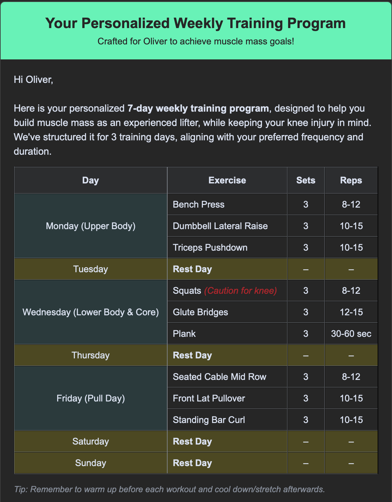
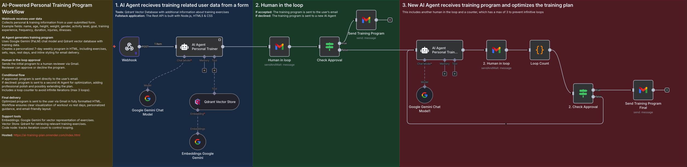

# AI-Powered Personal Training Program

An intelligent fitness application that generates personalized workout plans using AI, powered by Google's Gemini model and automated through n8n workflows.

## 🎯 Overview

This application collects user fitness data through a web form and automatically generates customized training programs tailored to individual goals, experience levels, and preferences. The entire process is automated using n8n workflows and delivers professionally formatted training plans directly to users' email.

**Live Demo:** [https://ai-training-plan.onrender.com/index.html](https://ai-training-plan.onrender.com/index.html)

## ✨ Features

- **Personalized Training Plans**: AI-generated workouts based on user-specific data
- **Comprehensive User Profiling**: Collects name, age, height, weight, gender, activity level, goals, training experience, frequency, duration, injuries, and fitness preferences
- **Human-in-the-Loop Verification**: Optional manual review and approval process before sending programs
- **Automated Email Delivery**: Professionally formatted training programs sent directly to users
- **Iterative Optimization**: Built-in loop mechanism for continuous program refinement
- **Vector Database Integration**: Stores and retrieves relevant training exercises using Qdrant

## 💪 Training Form 

The application collects the following user data:
Personal Information: Name, age, height, weight, gender
Fitness Profile: Activity level, training goal, experience level
Preferences: Training frequency, session duration, available equipment
Health Considerations: Injuries, fitness level, special requirements

## 🏗️ Architecture

The system consists of three main components:

### 1. AI Agent Workflow 

- Receives training form data via webhook
- Processes user information and generates initial training program
- Utilizes Google Gemini Chat Model for intelligent program creation
- Integrates with Qdrant Vector Store for exercise database
- Generates HTML-formatted workout plans with detailed instructions

### 2. Human-in-the-Loop Verification 

- Optional manual review step
- Allows human trainers to approve or modify AI-generated programs
- Sends approval requests via Gmail
- Waits for confirmation before proceeding

### 3. Program Optimization Loop

- Receives approved training program
- Performs iterative refinement (up to 3 loops)
- Uses Google Gemini Chat Model for optimization
- Checks final approval before delivery
- Sends completed program via email

## 🛠️ Technology Stack

- **Frontend**: HTML, CSS, JavaScript
- **Automation**: n8n workflow automation
- **AI Model**: Google Gemini Chat Model
- **Vector Database**: Qdrant Vector Store
- **Email Service**: Gmail integration
- **Embeddings**: Google Gemini embeddings for exercise representation
- **Code Execution**: Python for data processing and template generation

## 📋 Workflow Process

1. User submits training form with personal data
2. Webhook receives data and initiates workflow
3. AI Agent generates personalized training program
4. Program undergoes vector similarity search for relevant exercises
5. (Optional) Human reviewer approves program
6. Program enters optimization loop for refinement
7. Final approval check
8. Completed training program sent to user's email
